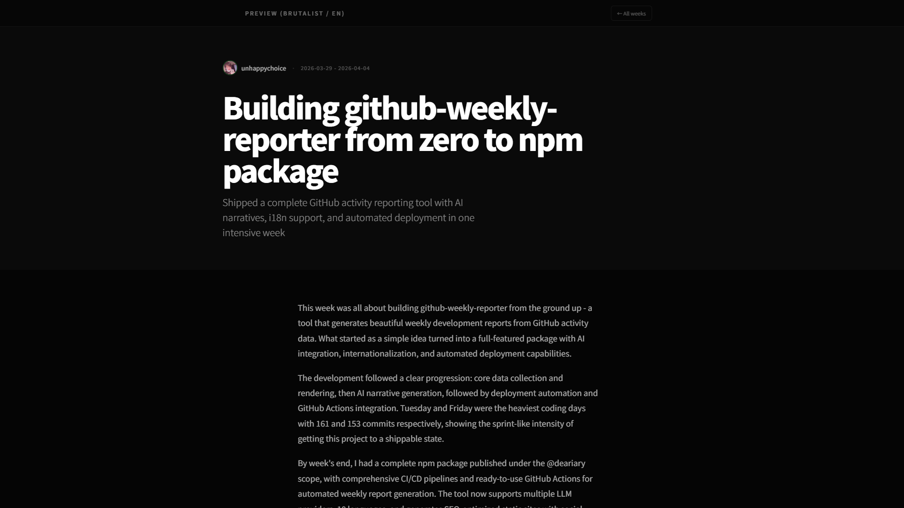
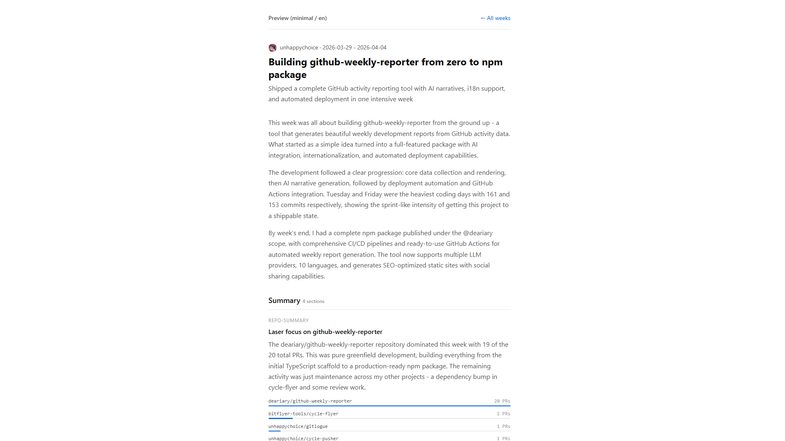
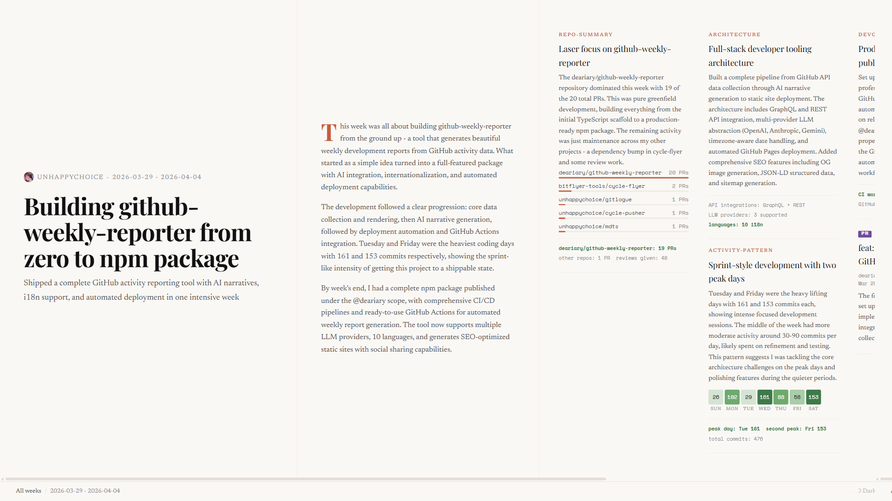

# GitHub Weekly Reporter

[](https://github.com/deariary/github-weekly-reporter/actions/workflows/ci.yml)
[](https://codecov.io/gh/deariary/github-weekly-reporter)
[](https://www.npmjs.com/package/github-weekly-reporter)

**Your GitHub activity, turned into a beautiful weekly report. Automatically.**

<video src="https://github.com/user-attachments/assets/96828826-d694-4338-89b9-974094b0950d" autoplay loop muted playsinline></video>

Every week, this tool looks at everything you did on GitHub (commits, pull requests, code reviews) and generates a polished, shareable report page with AI-written summaries. It runs as a GitHub Action, deploys to GitHub Pages, and costs nothing.

## What You Need

Have these two things ready before running setup:

1. **GitHub personal access token (PAT)**, either type works:

   - **Fine-grained PAT** (recommended): `All repositories` access with permissions:
     `Actions`, `Administration`, `Contents`, `Pages`, `Secrets`, `Workflows`
     (all Read & Write).
     ([Create one](https://github.com/settings/personal-access-tokens/new))
   - **Classic PAT**: scopes `repo` and `workflow`.
     ([Create one](https://github.com/settings/tokens/new?scopes=repo,workflow))
     Use this if you hit 403 errors with fine-grained tokens (e.g. org policy restrictions).

   > After setup, you can tighten the PAT to the minimum the Action actually needs. See [PAT Permissions](#pat-permissions).

2. **LLM API key** from any supported provider:

   | Provider | Free Tier | Get API Key |
   |---|---|---|
   | **OpenRouter** | Yes (25+ free models) | https://openrouter.ai/settings/keys |
   | **Groq** | Yes (generous limits) | https://console.groq.com/keys |
   | **Google Gemini** | Yes | https://aistudio.google.com/apikey |
   | OpenAI | No | https://platform.openai.com/api-keys |
   | Anthropic | No | https://console.anthropic.com/settings/keys |
   | Grok (xAI) | No | https://console.x.ai |

   You also need a **model name**. Find available models on your provider's page:
   [OpenRouter](https://openrouter.ai/models),
   [Groq](https://console.groq.com/docs/models),
   [Gemini](https://ai.google.dev/gemini-api/docs/models),
   [OpenAI](https://platform.openai.com/docs/models),
   [Anthropic](https://docs.anthropic.com/en/docs/about-claude/models),
   [Grok](https://docs.x.ai/docs/models)

## Quick Start

```bash
npx github-weekly-reporter setup
```

The setup command walks you through everything interactively:

1. Creates a repository for your reports
2. Adds workflow files (daily fetch + weekly report)
3. Stores secrets (PAT and LLM API key)
4. Enables GitHub Pages
5. Triggers your first report

Your first report will be live within 5 minutes.

See [Manual Setup](docs/manual-setup.md) if you prefer to configure everything yourself.

> **Security tip:** The setup command uses `@main` in the generated workflow files. For production use, pin the action to a commit SHA and the CLI to a specific version. See [Pinning Versions](docs/customization.md#pinning-versions).

## Cost

**The entire stack runs at $0/month on a public repository.**

| Component | Cost | Details |
|---|---|---|
| GitHub Actions | Free | ~80 min/month (30 daily runs + 4 weekly runs). Public repos have unlimited free minutes. |
| LLM | Free | One API call per week. OpenRouter, Groq, and Gemini all offer free tiers. |
| GitHub Pages | Free | Hosting and deployment included for public repos. |
| npm package | Free | Runs via `npx`, no installation required. |

On paid LLM providers (OpenAI, Anthropic, Grok), the cost is roughly $0.10-0.35/month (one call per week, ~4-8K tokens each).

Private repositories work too. GitHub Free gives 2,000 Actions minutes/month (this tool uses ~4% of that), but GitHub Pages on private repos requires a paid GitHub plan.

## Themes

Three built-in themes, each with light/dark mode and responsive design.

| Theme | Screenshot | Description |
|---|---|---|
| **brutalist** (default) |  | Bold, high-contrast dark theme with monospace typography. [Example](https://deariary.github.io/github-weekly-reporter/brutalist/en/2026/W14/) |
| **minimal** |  | Clean lines, generous whitespace, understated elegance. [Example](https://deariary.github.io/github-weekly-reporter/minimal/en/2026/W14/) |
| **editorial** |  | Horizontal-scroll magazine with serif typography and column layout. [Example](https://deariary.github.io/github-weekly-reporter/editorial/en/2026/W14/) |

Set the theme in your workflow or during `setup`:

```yaml
with:
  theme: 'editorial'
```

## Profile Card

Embed an animated news ticker in your GitHub Profile README. AI-generated headlines scroll with dramatic labels.

<picture>
  <source media="(prefers-color-scheme: dark)" srcset="https://deariary.github.io/github-weekly-reporter/screenshots/card-dark.svg" />
  <source media="(prefers-color-scheme: light)" srcset="https://deariary.github.io/github-weekly-reporter/screenshots/card.svg" />
  
</picture>

Generated automatically as part of the `render` command. Add this to your profile README:

```html
<a href="https://github.com/{username}/{repo}">
  <picture>
    <source media="(prefers-color-scheme: dark)" srcset="https://{username}.github.io/{repo}/card-dark.svg" />
    <source media="(prefers-color-scheme: light)" srcset="https://{username}.github.io/{repo}/card.svg" />
    
  </picture>
</a>
```

## Features

- Weekly stats: commits, PRs opened/merged, reviews
- Top repositories by activity
- Language breakdown (CSS-only chart)
- 7-day contribution heatmap
- AI-generated narrative summary
- Light/dark mode with responsive design
- Self-contained HTML, no JavaScript
- SEO optimized (OG images, JSON-LD, sitemap)
- Deploys to GitHub Pages with weekly archive
- 10 languages supported

## PAT Permissions

The `setup` command and the GitHub Action (runtime) need different levels of access. If you set things up manually, you can use a much more limited token.

### For the GitHub Action (runtime)

The Action reads your public activity and pushes to the `gh-pages` branch. This is all it needs:

| | Fine-grained PAT | Classic PAT |
|---|---|---|
| Repository access | Your report repository only | - |
| Permissions / Scopes | `Contents: Read & Write` | `repo` |

Fine-grained PATs always include read-only access to all public repositories on GitHub, so selecting only the report repository is enough. `Contents: Write` is needed to push to the `gh-pages` branch.

### For `npx github-weekly-reporter setup`

The setup command creates a repository, stores secrets, adds workflow files, enables Pages, and triggers the first run. It needs broader permissions:

| | Fine-grained PAT | Classic PAT |
|---|---|---|
| Repository access | `All repositories` | - |
| Permissions / Scopes | `Actions`, `Administration`, `Contents`, `Pages`, `Secrets`, `Workflows` (all Read & Write) | `repo` + `workflow` |

After setup completes, you can replace the PAT stored in the `GH_PAT` secret with a more restricted one (runtime permissions only). The setup-level permissions are not needed again unless you re-run the setup command.

## Supported Languages

| Code | Language |
|---|---|
| `en` | English |
| `ja` | Japanese |
| `zh-CN` | Chinese (Simplified) |
| `zh-TW` | Chinese (Traditional) |
| `ko` | Korean |
| `es` | Spanish |
| `fr` | French |
| `de` | German |
| `pt` | Portuguese |
| `ru` | Russian |

## Documentation

- [How It Works](docs/how-it-works.md): the pipeline, data flow, and what gets collected
- [Manual Setup](docs/manual-setup.md): step-by-step guide without the setup command
- [Customization](docs/customization.md): change language, timezone, LLM provider, custom domain, and more
- [CLI Reference](docs/cli-reference.md): all commands and environment variables
- [FAQ](docs/faq.md): common questions about cost, privacy, and limitations
- [Troubleshooting](docs/troubleshooting.md): fixing workflow failures, missing data, and setup errors

## License

See [LICENSE](./LICENSE) for details.

- Commercial use: "Powered by deariary" footer link must be retained
- Personal/non-commercial use: footer link may be removed
- Derivative works: same conditions apply
